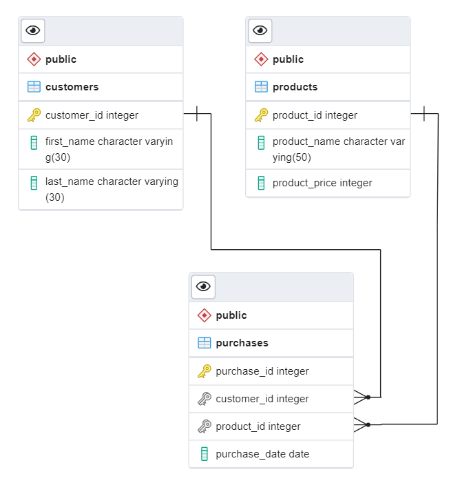
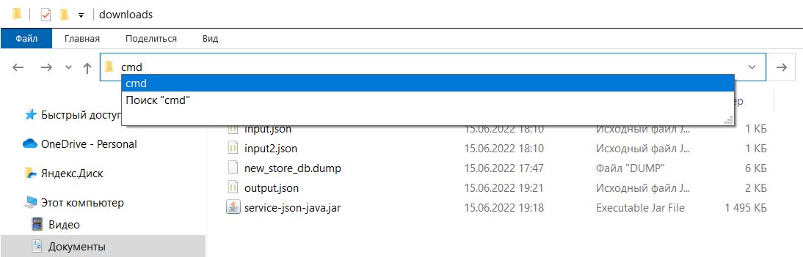
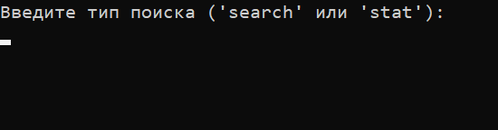
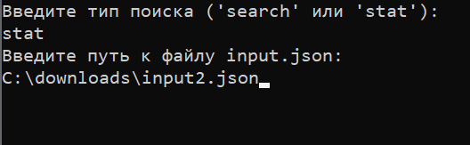
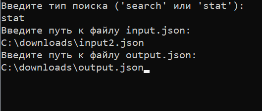
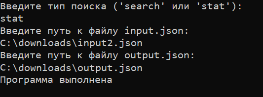

# Service JSON (Java)
Приложение, предоставляющее сервис работы с данными в БД. Данный сервис, на основании входных параметров: аргументы командной строки (тип операции и входного файла формата .json) – извлекает необходимые данные из БД и формирует результат обработки в выходной файл (\*.json).

Технологии: **Java 8, PostgreSQL, Maven, JSON**.

Содержание:
- [Описание работы программы](#description)
- [Инструкция по установке и запуску программы (Windows)](#instructions)
  

 
# Описание работы программы:

## Структура данных:

- Покупатели (customers):
    - id_покупателя (customer_id)
    - имя (first_name)
    - фамилия (last_name)
- Товары (products):
    - id_товара (product_id)
    - название (product_name)
    - цена (product_price)
- Покупки (purchases):
    - id_покупки (purchase_id)
    - id_покупателя (customer_id)
    - id_товара (product_id)
    - дата покупки (purchase_date)
  

Графическое представление струткуры данных:

## Типы и описание операций:

Операции определяются по входному параметру:
- **Поиск покупателей по критериям (search)**

Во входном файле (input.json) передаётся список критериев для поиска покупателей. Результат операции - списки покупателей для каждого критерия из запроса. Порядок списков такой же как в запросе, порядок покупателей в списке — произвольный.
 
Критерии*:

1. Фамилия — поиск покупателей с этой фамилией
2. Название товара и число раз — поиск покупателей, купивших этот товар не менее, чем указанное число раз
3. Минимальная и максимальная стоимость всех покупок — поиск покупателей, у которых общая стоимость всех покупок за всё время попадает в интервал
4. Число пассивных покупателей — поиск покупателей, купивших меньше всего товаров. Возвращается не более, чем указанное число покупателей.

*Критерии могут повторяться. Например, два раза критерий с lastName.

Пример:

INPUT
{

	"criterias": [ 
	    {"lastName": "Иванов"}, //Фамилия
		          {"productName": "Минеральная вода", "minTimes": 5}, // Название товара и число раз
	    {"minExpenses": 112, "maxExpenses": 4000}, //Минимальная и максимальная стоимость всех покупок
	          {"badCustomers": 3} //Число пассивных покупателей
      ]
}

OUTPUT
{

    "type": "search", // Тип результата
    "results": [ // Списки покупателей
        {
            "criteria": {"lastName": "Иванов"}, // Критерий из запроса
            "results": [ // Список покупателей
                {"lastName: "Иванов", "firstName": "Антон"}, // Фамилия и имя покупателя
                {"lastName: "Иванов", "firstName": "Николай"}
                ...
            ]
        },
        {
            "criteria": {"productName": "Минеральная вода", "minTimes": 5}, // Критерий из запроса
            "results": [
                {"lastName": "Петров", "firstName": "Валентин"}, // Фамилия и имя покупателя
                ... 
            ]
        },
        ...
    ]
}

- **Статистика за период (stat)**

Во входном файле (input2.json) передаётся интервал дат сбора статистики. Результат операции - статистика по покупателям за период из двух дат, включительно, без выходных.

Пример:

INPUT
{

    "startDate": "2021-05-10", // Начальная дата
    "endDate": "2021-05-26" // Конечная дата
}

OUTPUT
{
    
    "type": "stat" // Тип результата
    "totalDays": 9, // Общее число дней за период из двух дат, включительно, без выходных
    "customers": [ // Данные по покупателям за этот период, упорядоченные по общей стоимости покупок по убыванию
         { // Данные первого покупателя
                "name": "Иванов Антон", // Фамилия и имя покупателя
                "purchases": [ // Список всех уникальных товаров, купленных покупателем за этот период, упорядоченных по суммарной стоимости по убыванию
                    {
                        "name": "Хлеб", // Название товара
                        "expenses": 540 // Суммарная стоимость всех покупок этого товара за период
                    },
                    {
                        "name": "Сметана", 
                        "expenses": 517
                    }, 
                    {
                        "name": "Колбаса", 
                        "expenses": 332
                    },
                    ...
                ],
                "totalExpenses": 4100 // Общая стоимость покупок этого покупателя за период (то есть сумма всех стоимостей покупок всех товаров)
        },
        { // Данные второго покупателя
            "name": "Петров Валентин",
            "purchases": [
                {
                    "name": "Сыр", 
                    "expenses": 470                    
                },
                {
                    "name": "Хлеб", 
                    "expenses": 300
                }, 
                {
                    "name": "Минеральная вода", 
                    "expenses": 120
                },
                ...
            ],
            "totalExpenses": 3700
        },
        ...
    ]
    "totalExpenses": 19920, // Сумма покупок всех покупателей за период
    "avgExpenses": 3455.72 // Средние затраты всех покупателей за период
}

 - **В случае возникновения ошибки, при выполнении любой операции - фиксируется результат:**

OUTPUT
{

    "type": "error", // Тип результата
    "message": "Неправильный формат даты" // Описание ошибки
}
  

# Инструкция по установке и запуску программы (Windows):

*Для успешной работы программы:*

*- должна быть установлена БД PostgreSQL (https://www.postgresql.org/download/),*

*- должен быть установлен JDK (https://www.oracle.com/java/technologies/downloads/#jdk18-windows),*

*- также папка /bin каждой из этих программ должна быть добавлена в переменные среды (инструкция тут: https://docs.microsoft.com/ru-ru/previous-versions/office/developer/sharepoint-2010/ee537574(v=office.14)).*

## Установка и запуск программы:
1. Скачать папку /downloads.
2. Установить дамп базы данных:

2.1. Создать в БД PostgreSQL базу данных с именем 'new_store_db', именем пользователя 'postgres' и паролем '1234'.

2.2. Для восстановления БД в командной строке ввести: 

psql -U postgres -W new_store_db < C:/.../new_store_db.dump

где:
- postgres - имя пользователя,
- new_store_db - имя БД,
- после значка '<' следует ввести полный путь* к файлу 'new_store_db.dump'.

*\*Примечание: в пути к файлу не должно быть папок с именем, содержащим символ пробела.*

3. Из скачанной папки /downloads запустить командную строку (ввести команду 'cmd' в адресной строке):

    
4. В командной строке набрать: 'java -jar service-json-java.jar'
(запустится исполняемый файл service-json-java.jar).
5. В командной строке будет предложено ввести тип поиска:
- 'search' - поиск покупателей по критериям;
- 'stat' - сбор статистики за период.

    
6. Введите тип поиска, например 'stat'.
7. Затем, будет предложено ввести путь к файлу с входящими параметрами input.json. В папке /downloads прилагаются два файла для тестирования:
- input.json - файл с критериями для поиска покупателей (для команды 'search');
- input2.json - файл с датами для сбора статистики за период между этими датами (для команды 'stat').

    ***Важно: желательная кодировка символов для входящего файла - "UTF-8".***

    Например, введем путь к файлу input2.json (поскольку он содержит критерии для сбора статистики):

    

8. После этого, будет предложено ввести путь к файлу для записи результатов output.json (в папке /dowloads прилагается тестовый файл output.json). Например, вводим путь для этого файла:

    
9. Далее программа начинает выполняться и, если она выполнено успешно\*, то увидим такое сообщение:

    

    \* Вслучае каких-либо ошибок, программа выведет сообщение об ошибке на консоль, а также запишет файл output.json с описанием ошибки.
10. Всё, программа выполнена!